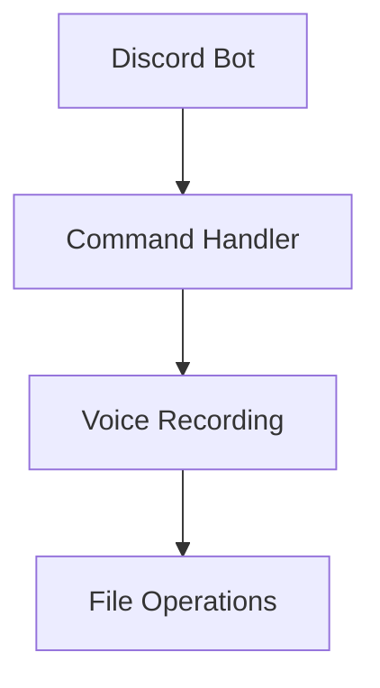

# System Patterns: Discord Voice Recorder

## Simple Architecture Overview



## Core Components

### Main Bot File (index.js)
- Discord.js client setup
- Command handling
- Event listeners
- Basic error handling

### Voice Recording Module (optional separate file)
- Voice channel connection
- Recording functionality
- File conversion
- Upload handling

## Implementation Patterns

### Command Handling
- Simple if/else or switch statement for commands
- Direct command-to-function mapping
- Minimal middleware

### Recording Flow
1. User sends `!record`
   - Check if user is in voice channel
   - Join channel
   - Start recording

2. User sends `!stop`
   - Stop recording
   - Convert to MP3
   - Upload file
   - Cleanup

### File Management
- Simple temporary file storage
- Basic cleanup after upload
- Sequential file naming

## Error Handling
- Basic try/catch blocks
- Simple error messages
- Graceful disconnection handling

## Technical Integration
- discord.js for bot functionality
- ffmpeg for audio conversion
- Basic file system operations

## Code Organization
```javascript
// Example structure
const client = new Discord.Client()

// Command handling
client.on('messageCreate', message => {
  if (message.content === '!record') {
    // Recording logic
  }
  if (message.content === '!stop') {
    // Stop and upload logic
  }
})

// Voice handling
async function handleVoiceRecording() {
  // Recording implementation
}

// File operations
async function handleFileOperations() {
  // File processing and upload
}
```

## System Constraints
- Single voice channel recording at a time
- Local file system storage
- Basic error recovery
